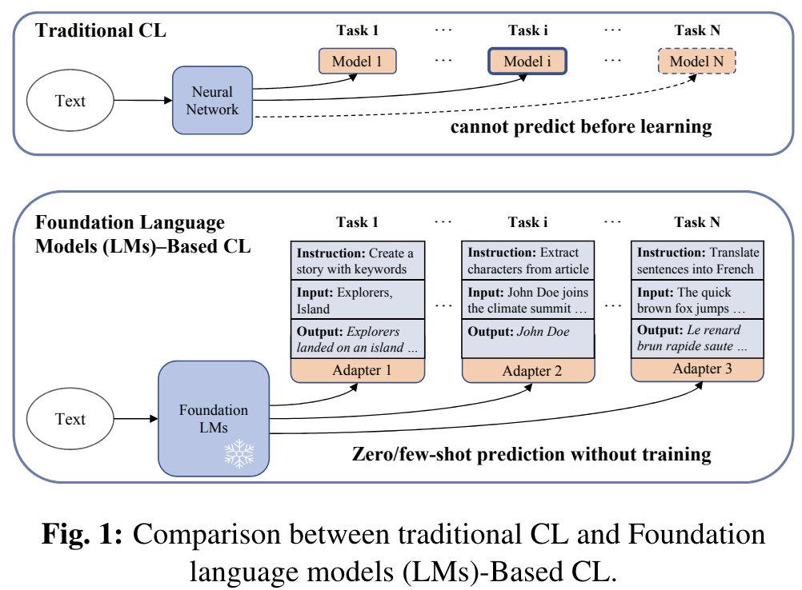
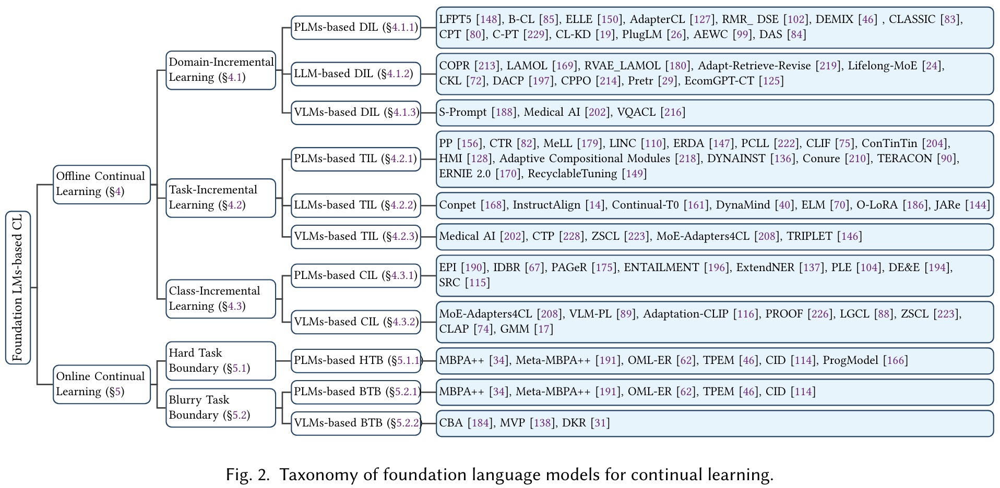
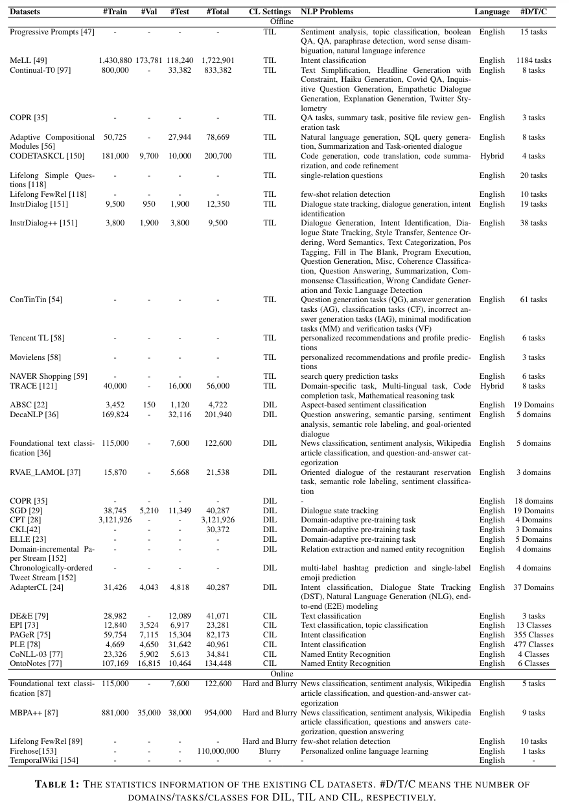

# Survey of Foundation LMs-based Continual-Learning
In the domain of continual learning, there has been a significant paradigm shift from traditional methodologies to those that integrate foundation LMs. First, foundation LMs demonstrate enhanced generalization and transfer learning abilities across diverse tasks owing to their broad pre-training on large-scale datasets. The model has specialized transfer capability to quickly adapt to downstream tasks with only a few samples. Consequently, it is crucial to mitigate the degradation of both the zero-shot transfer and history task abilities in LMs while facilitating the acquisition of new skills. Second, due to the substantial number of parameters in foundation LMs, it is crucial to employ parameter-efficient techniques, such as prompt tuning and adapters, to update parameters without comprehensive retraining. Third, the foundation LMs possess the capability to follow instructions through instructional learning, enabling more dynamic and context-aware interactions.

<p align="center">

</p>

This is an updating survey for Foundation Language Models-based Continual Learning, a constantly updated and extended version of the manuscript: 
<p align="center">

</p>


<!-- 
<details>
  <summary>Table of Contents</summary>
  <ol>
    <li>
      <a href="#Related-Surveys">Related Surveys</a>
      <ul>
        <li><a href="#Continual-Learning">Continual Learning</a></li>
        <li><a href="#Continual-Learning-for-Computer-Vision">Continual Learning for Computer Vision</a></li>
        <li><a href="#Continual-Learning-for-NLP">Continual Learning for NLP</a></li>
        <li><a href="#Continual-Learning-for-Other-Domains">Continual Learning for Other Domains</a></li>
      </ul>
    </li>
    <li>
      <a href="#Offline-Continual-Learning">Offline Continual Learning</a>
      <ul>
        <li><a href="#Domain-Incremental-Learning">Domain-Incremental Learning</a></li>
        <li><a href="#Task-Incremental-Learning">Task-Incremental Learning</a></li>
        <li><a href="#Class-Incremental-Learning">Class-Incremental Learning</a></li>
      </ul>
    </li>
    <li>
      <a href="#Online-Continual-Learning">Online Continual Learning</a>
      <ul>
        <li><a href="#Hard-Task-Boundary">Hard Task Boundary</a></li>
        <li><a href="#Blurry-Task-Boundary">Blurry Task Boundary</a></li>
      </ul>
    </li>
    <li><a href="#DATASET">DATASET</a></li>
  </ol>
</details> -->

## Content

- [Related Surveys](#Related-Surveys)
  - [Continual Learning](#Continual-Learning)
  - [Continual Learning for Computer Vision](#Continual-Learning-for-Computer-Vision)
  - [Continual Learning for NLP](#Continual-Learning-for-NLP)
  - [Continual Learning for Other Domains](#Continual-Learning-for-Other-Domains)
- [Offline Continual Learning](#Offline-Continual-Learning)
  - [Domain-Incremental Learning](#Domain-Incremental-Learning)
    - [PLMs-based DIL](#PLMs-based-DIL)
    - [LLMs-based DIL](#LLMs-based-DIL)
    - [VLMs-based DIL](#VLMs-based-DIL)
  - [Task-Incremental Learning](#Task-Incremental-Learning)
    - [PLMs-based TIL](#PLMs-based-TIL)
    - [LLMs-based TIL](#LLMs-based-TIL)
    - [VLMs-based TIL](#VLMs-based-TIL)
  - [Class-Incremental Learning](#Class-Incremental-Learning)
    - [PLMs-based CIL](#PLMs-based-CIL)
    - [VLMs-based CIL](#VLMs-based-CIL)
- [Online Continual Learning](#Online-Continual-Learning)
  - [Hard Task Boundary](#Hard-Task-Boundary)
    - [PLMs-based HTB](#PLMs-based-HTB)
  - [Blurry Task Boundary](#Blurry-Task-Boundary)
    - [PLMs-based BTB](#PLMs-based-BTB)
    - [VLMs-based BTB](#VLMs-based-BTB)
- [DATASET](#DATASET)
- [Reference](#Reference)

## Related Surveys
### Continual Learning
- Continual lifelong learning with neural networks: A review [[paper](https://www.sciencedirect.com/science/article/pii/S0893608019300231)]
- A Comprehensive Survey of Continual Learning: Theory, Method and Application [[paper](https://ieeexplore.ieee.org/document/10444954?denied=)]
- Deep Class-Incremental Learning: A Survey [[paper](https://arxiv.org/abs/2302.03648)]
- Replay in Deep Learning: Current Approaches and Missing Biological Elements [[paper](https://arxiv.org/abs/2104.04132)]
### Continual Learning for Computer Vision
- A Continual Learning Survey: Defying Forgetting in Classification Tasks [[paper](https://ieeexplore.ieee.org/document/9349197?denied=)]
- Recent Advances of Continual Learning in Computer Vision: An Overview [[paper](https://arxiv.org/abs/2109.11369)]
- Online continual learning in image classification: An empirical survey [[paper](https://www.sciencedirect.com/science/article/abs/pii/S0925231221014995)]
- Class-Incremental Learning: Survey and Performance Evaluation on Image Classification [[paper](https://www.computer.org/csdl/journal/tp/2023/05/09915459/1Hmg3DI0clq)]
- A comprehensive study of class incremental learning algorithms for visual tasks [[paper](https://www.sciencedirect.com/science/article/abs/pii/S0893608020304202)]
### Continual Learning for NLP
- Continual Lifelong Learning in Natural Language Processing: A Survey [[paper](https://aclanthology.org/2020.coling-main.574/)]
- Continual Learning of Natural Language Processing Tasks: A Survey [[paper](https://arxiv.org/abs/2211.12701)]
### Continual Learning for Other Domains
- A Survey on Incremental Update for Neural Recommender Systems [[paper](https://arxiv.org/abs/2303.02851)]
- Continual Learning for Real-World Autonomous Systems: Algorithms, Challenges and Frameworks [[paper](https://link.springer.com/article/10.1007/s10846-022-01603-6)]
- Continual learning for robotics: Definition, framework, learning strategies, opportunities and challenges [[paper](https://www.sciencedirect.com/science/article/abs/pii/S1566253519307377)]
## OFFLINE CONTINUAL LEARNING
### Domain-Incremental Learning
#### PLMs-based DIL
##### Traditional Methods
- Overcoming Catastrophic Forgetting During Domain Adaptation of Seq2seq Language Generation [[paper](https://aclanthology.org/2022.naacl-main.398/)]
- Learning to Solve NLP Tasks in an Incremental Number of Languages [[paper](https://aclanthology.org/2021.acl-short.106/)]
- Toward Continual Learning for Conversational Agents [[paper](https://arxiv.org/abs/1712.09943)]
- DEMix Layers: Disentangling Domains for Modular Language Modeling [[paper](https://aclanthology.org/2022.naacl-main.407/)]
- Decouple knowledge from parameters for plug-and-play language modeling [[paper](https://aclanthology.org/2023.findings-acl.901/)]
##### Continual Pre-training Methods
- Continual Pre-training of Language Models [[paper](https://arxiv.org/abs/2302.03241)]
- Continual Pre-Training Mitigates Forgetting in Language and Vision [[paper](https://arxiv.org/abs/2205.09357)]
##### Parameter-Efficient Tuning Methods
- Parameter-Efficient Transfer Learning for NLP [[paper](https://arxiv.org/abs/1902.00751)]
- Adapters: A Unified Library for Parameter-Efficient and Modular Transfer Learning [[paper](https://aclanthology.org/2023.emnlp-demo.13.pdf)]
- P-Tuning: Prompt Tuning Can Be Comparable to Fine-tuning Across Scales and Tasks [[paper](https://aclanthology.org/2022.acl-short.8/)]
- Continual Learning in Task-Oriented Dialogue Systems [[paper](https://aclanthology.org/2021.emnlp-main.590/)]
- Adapting BERT for Continual Learning of a Sequence of Aspect Sentiment Classification Tasks [[paper](https://aclanthology.org/2021.naacl-main.378.pdf)]
- CLASSIC: Continual and Contrastive Learning of Aspect Sentiment Classification Tasks [[paper](https://aclanthology.org/2021.emnlp-main.550/)]
- Continual Prompt Tuning for Dialog State Tracking [[paper](https://aclanthology.org/2022.acl-long.80/)]
- Continual Training of Language Models for Few-Shot Learning [[paper](https://aclanthology.org/2022.emnlp-main.695.pdf)]
- LFPT5: A Unified Framework for Lifelong Few-shot Language Learning Based on Prompt Tuning of T5 [[paper](https://arxiv.org/abs/2110.07298)]
##### Instruction Tuning-based Methods
- ELLE: Efficient Lifelong Pre-training for Emerging Data [[paper](https://aclanthology.org/2022.findings-acl.220.pdf)]
#### LLMs-based DIL
##### Traditional Methods
- CPPO: Continual Learning for Reinforcement Learning with Human Feedback [[paper](https://iclr.cc/virtual/2024/poster/19338)]
- COPR: Continual Learning Human Preference through Optimal Policy Regularization [[paper](https://arxiv.org/pdf/2310.15694)]
- LAMOL: LAnguage MOdeling for Lifelong Language Learning [[paper](https://arxiv.org/abs/1909.03329)]
- RVAE-LAMOL: Residual Variational Autoencoder to Enhance Lifelong Language Learning [[paper](https://arxiv.org/abs/2205.10857)]
- Reformulating Domain Adaptation of Large Language Models as Adapt-Retrieve-Revise [[paper](https://arxiv.org/abs/2310.03328)]
- Continual Learning Under Language Shift [[paper](https://arxiv.org/abs/2311.01200)]
- Towards Continual Knowledge Learning of Language Models [[paper](https://arxiv.org/abs/2110.03215)]
##### Continual Pre-training Methods
- Efficient Continual Pre-training for Building Domain Specific Large Language Models [[paper](https://arxiv.org/abs/2311.08545)]
- EcomGPT-CT: Continual Pre-training of E-commerce Large Language Models with Semi-structured Data [[paper](https://arxiv.org/abs/2312.15696)]
- Adapting Large Language Models via Reading Comprehension [[paper](https://arxiv.org/abs/2309.09530)]
##### Parameter-Efficient Tuning Methods
- Lifelong language pretraining with distribution-specialized experts [[paper](https://dl.acm.org/doi/10.5555/3618408.3618621)]
#### VLMs-based DIL
- Towards General Purpose Medical AI: Continual Learning Medical Foundation Model [[paper](https://arxiv.org/abs/2303.06580)]
- S-Prompts Learning with Pre-trained Transformers: An Occam's Razor for Domain Incremental Learning [[paper](https://proceedings.neurips.cc/paper_files/paper/2022/file/25886d7a7cf4e33fd44072a0cd81bf30-Paper-Conference.pdf)]
- VQACL: A Novel Visual Question Answering Continual Learning Setting [[paper](https://openaccess.thecvf.com/content/CVPR2023/papers/Zhang_VQACL_A_Novel_Visual_Question_Answering_Continual_Learning_Setting_CVPR_2023_paper.pdf)]
### Task-Incremental Learning
#### PLMs-based TIL
##### Traditional Methods
- Generative Replay Inspired by Hippocampal Memory Indexing for Continual Language Learning [[paper](https://aclanthology.org/2023.eacl-main.65/)]
- Continual Few-shot Relation Learning via Embedding Space Regularization and Data Augmentation [[paper](https://aclanthology.org/2022.acl-long.198/)]
- Sentence Embedding Alignment for Lifelong Relation Extraction [[paper](https://aclanthology.org/N19-1086/)]
- One Person, One Model, One World: Learning Continual User Representation without Forgetting [[paper](https://dl.acm.org/doi/abs/10.1145/3404835.3462884)]
- Task Relation-aware Continual User Representation Learning [[paper](https://dl.acm.org/doi/abs/10.1145/3580305.3599516)]
- Achieving Forgetting Prevention and Knowledge Transfer in Continual Learning [[paper](https://arxiv.org/abs/2112.02706)]
- Achieving Forgetting Prevention and Knowledge Transfer in Continual Learning [[paper](https://proceedings.neurips.cc/paper/2021/hash/bcd0049c35799cdf57d06eaf2eb3cff6-Abstract.html)]
- MeLL: Large-scale Extensible User Intent Classification for Dialogue Systems with Meta Lifelong Learning [[paper](https://dl.acm.org/doi/abs/10.1145/3447548.3467107)]
- Lifelong and Continual Learning Dialogue Systems: Learning during Conversation [[paper](https://ojs.aaai.org/index.php/AAAI/article/view/17768)]
- Lifelong and Continual Learning Dialogue System [[paper](https://books.google.com.sg/books?hl=en&lr=&id=qvzsEAAAQBAJ&oi=fnd&pg=PR7&dq=Lifelong+and+Continual+Learning+Dialogue+System&ots=124YNrCIxl&sig=Gt0IXvSOQmIXZbcHXsn0Ct7XHDE&redir_esc=y#v=onepage&q=Lifelong%20and%20Continual%20Learning%20Dialogue%20System&f=false)]
- Learning on the Job: Online Lifelong and Continual Learning [[paper](https://ojs.aaai.org/index.php/AAAI/article/view/7079)]
##### Continual Pre-training Methods
- ERNIE 2.0: A Continual Pre-Training Framework for Language Understanding [[paper](https://ojs.aaai.org/index.php/AAAI/article/view/6428)]
- Recyclable Tuning for Continual Pre-training [[paper](https://aclanthology.org/2023.findings-acl.723.pdf)]
##### Parameter-Efficient Tuning Methods
- Continual Sequence Generation with Adaptive Compositional Modules [[paper](https://aclanthology.org/2022.acl-long.255/)]
- Learn Continually, Generalize Rapidly: Lifelong Knowledge Accumulation for Few-shot Learning [[paper](https://aclanthology.org/2021.findings-emnlp.62/)]
##### Instruction Tuning-based Methods
- Prompt Conditioned VAE: Enhancing Generative Replay for Lifelong Learning in Task-Oriented Dialogue [[paper](https://aclanthology.org/2022.emnlp-main.766/)]
- Progressive Prompts: Continual Learning for Language Models [[paper](https://iclr.cc/virtual/2023/poster/10917)]
- ConTinTin: Continual Learning from Task Instructions [[paper](https://aclanthology.org/2022.acl-long.218/)]
- Large-scale Lifelong Learning of In-context Instructions and How to Tackle It [[paper](https://aclanthology.org/2023.acl-long.703/)]
#### LLMs-based TIL
##### Traditional Methods
- From Static to Dynamic: A Continual Learning Framework for Large Language Models [[paper](https://arxiv.org/abs/2310.14248)]
- An Empirical Study of Catastrophic Forgetting in Large Language Models During Continual Fine-tuning [[paper](https://ui.adsabs.harvard.edu/abs/2023arXiv230808747L/abstract)]
- TRACE: A Comprehensive Benchmark for Continual Learning in Large Language Models [[paper](https://arxiv.org/abs/2310.06762)]
- Scalable Language Model with Generalized Continual Learning [[paper](https://iclr.cc/virtual/2024/poster/17874)]
##### Parameter-Efficient Tuning Methods
- ConPET: Continual Parameter-Efficient Tuning for Large Language Models [[paper](https://arxiv.org/abs/2309.14763)]
- Exploring the Benefits of Training Expert Language Models over Instruction Tuning [[paper](https://proceedings.mlr.press/v202/jang23a.html)]
- Orthogonal Subspace Learning for Language Model Continual Learning [[paper](https://aclanthology.org/2023.findings-emnlp.715/)]
##### Instruction Tuning-based Methods
- Fine-tuned Language Models are Continual Learners [[paper](https://aclanthology.org/2022.emnlp-main.410/)]
- InstructAlign: High-and-Low Resource Language Alignment via Continual Crosslingual Instruction Tuning [[paper](https://aclanthology.org/2023.sealp-1.5/)]
#### VLMs-based TIL
##### Traditional Methods
- CTP: Towards Vision-Language Continual Pretraining via Compatible Momentum Contrast and Topology Preservation [[paper](https://openaccess.thecvf.com/content/ICCV2023/papers/Zhu_CTPTowards_Vision-Language_Continual_Pretraining_via_Compatible_Momentum_Contrast_and_Topology_ICCV_2023_paper.pdf)]
- Preventing Zero-Shot Transfer Degradation in Continual Learning of Vision-Language Models [[paper](https://openaccess.thecvf.com/content/ICCV2023/papers/Zheng_Preventing_Zero-Shot_Transfer_Degradation_in_Continual_Learning_of_Vision-Language_Models_ICCV_2023_paper.pdf)]
##### Instruction Tuning-based Methods
- Decouple Before Interact: Multi-Modal Prompt Learning for Continual Visual Question Answering [[paper](https://openaccess.thecvf.com/content/ICCV2023/papers/Qian_Decouple_Before_Interact_Multi-Modal_Prompt_Learning_for_Continual_Visual_Question_ICCV_2023_paper.pdf)]
- CoIN: A Benchmark of Continual Instruction tuNing for Multimodel Large Language Model [[paper](https://arxiv.org/abs/2403.08350#:~:text=CoIN%3A%20A%20Benchmark%20of%20Continual%20Instruction%20tuNing%20for%20Multimodel%20Large%20Language%20Model,-Cheng%20Chen%2C%20Junchen&text=Instruction%20tuning%20represents%20a%20prevalent,and%20adapt%20to%20new%20tasks.)]
##### Parameter-Efficient Methods
- Boosting Continual Learning of Vision-Language Models via Mixture-of-Experts Adapters [[paper](https://arxiv.org/abs/2403.11549)]
### Class-Incremental Learning
#### PLMs-based CIL
##### Traditional Methods
- Continual Learning for Named Entity Recognition [[paper](https://ojs.aaai.org/index.php/AAAI/article/view/17600)]
- Continual Learning for Sentence Representations Using Conceptors [[paper](https://aclanthology.org/N19-1331/)]
- Continual Learning for Text Classification with Information Disentanglement Based Regularization [[paper](https://aclanthology.org/2021.naacl-main.218/)]
##### Instruction Tuning-based Methods
- Prompt Augmented Generative Replay via Supervised Contrastive Learning for Lifelong Intent Detection [[paper](https://aclanthology.org/2022.findings-naacl.84/)]
##### Parameter-Efficient Tuning Methods
- Continual Few-shot Intent Detection [[paper](https://aclanthology.org/2022.coling-1.26/)]
- Rehearsal-free Continual Language Learning via Efficient Parameter Isolation [[paper](https://aclanthology.org/2023.acl-long.612.pdf)]
- Domain-Agnostic Neural Architecture for Class Incremental Continual Learning in Document Processing Platform [[paper](https://aclanthology.org/2023.acl-industry.51/)]
#### VLMs-based CIL
##### Traditional Methods
- VLM-PL: Advanced Pseudo Labeling Approach for Class Incremental Object Detection via Vision-Language Model [[paper](https://arxiv.org/abs/2403.05346)]
- Learning without Forgetting for Vision-Language Models [[paper](https://arxiv.org/abs/2305.19270)]
- CLAP4CLIP: Continual Learning with Probabilistic Finetuning for Vision-Language Models [[paper](https://arxiv.org/abs/2403.19137)]
- Generative Multi-modal Models are Good Class-Incremental Learners [[paper](https://arxiv.org/abs/2403.18383)]
##### Parameter-Efficient Tuning Methods
- Class Incremental Learning with Pre-trained Vision-Language Models [[paper](https://arxiv.org/abs/2310.20348)]
##### Instruction Tuning-based Methods
- Introducing Language Guidance in Prompt-based Continual Learning [[paper](https://openaccess.thecvf.com/content/ICCV2023/html/Khan_Introducing_Language_Guidance_in_Prompt-based_Continual_Learning_ICCV_2023_paper.html)]
## ONLINE CONTINUAL LEARNING
### Hard Task Boundary
#### PLMs-based HTB
- A Progressive Model to Enable Continual Learning for Semantic Slot Filling [[paper](https://aclanthology.org/D19-1126/)]
- Online Continual Learning in Keyword Spotting for Low-Resource Devices via Pooling High-Order Temporal Statistics [[paper](https://arxiv.org/abs/2307.12660)]
- Rehearsal-Free Online Continual Learning for Automatic Speech Recognition [[paper](https://arxiv.org/abs/2306.10860)]
##### Traditional Methods
- Episodic Memory in Lifelong Language Learning [[paper](https://proceedings.neurips.cc/paper/2019/hash/f8d2e80c1458ea2501f98a2cafadb397-Abstract.html)]
- Efficient Meta Lifelong-Learning with Limited Memory [[paper](https://aclanthology.org/2020.emnlp-main.39/)]
- Meta-Learning with Sparse Experience Replay for Lifelong Language Learning [[paper](https://arxiv.org/abs/2009.04891)]
- Rehearsal-Free Online Continual Learning for Automatic Speech Recognition [[paper](https://arxiv.org/abs/2306.10860)]
- Lifelong Intent Detection via Multi-Strategy Rebalancing [[paper](https://arxiv.org/abs/2108.04445)]
### Blurry Task Boundary
#### PLMs-based BTB
- Episodic Memory in Lifelong Language Learning [[paper](https://proceedings.neurips.cc/paper/2019/hash/f8d2e80c1458ea2501f98a2cafadb397-Abstract.html)]
- Efficient Meta Lifelong-Learning with Limited Memory [[paper](https://aclanthology.org/2020.emnlp-main.39/)]
- Continual Learning for Task-oriented Dialogue System with Iterative Network Pruning, Expanding and Masking [[paper](https://aclanthology.org/2021.acl-short.66/)]
- Meta-Learning Representations for Continual Learning [[paper](https://papers.nips.cc/paper_files/paper/2019/hash/f4dd765c12f2ef67f98f3558c282a9cd-Abstract.html)]
- Meta-Learning with Sparse Experience Replay for Lifelong Language Learning [[paper](https://arxiv.org/abs/2009.04891)]
#### VLMs-based BTB
##### Traditional Methods
- Continual Vision-Language Retrieval via Dynamic Knowledge Rectification [[paper](https://ojs.aaai.org/index.php/AAAI/article/view/29054)]
##### Parameter-Efficient Tuning Methods
- CBA: Improving Online Continual Learning via Continual Bias Adaptor [[paper](https://openaccess.thecvf.com/content/ICCV2023/html/Wang_CBA_Improving_Online_Continual_Learning_via_Continual_Bias_Adaptor_ICCV_2023_paper.html)]
##### Instruction Tuning-based Methods
- Online Class Incremental Learning on Stochastic Blurry Task Boundary via Mask and Visual Prompt Tuning [[paper](https://openaccess.thecvf.com/content/ICCV2023/html/Moon_Online_Class_Incremental_Learning_on_Stochastic_Blurry_Task_Boundary_via_ICCV_2023_paper.html)]
## DATASET
<p align="center">

</p>

## Reference
If you find our survey or this collection of papers useful, please consider citing our work by
```bib

```


